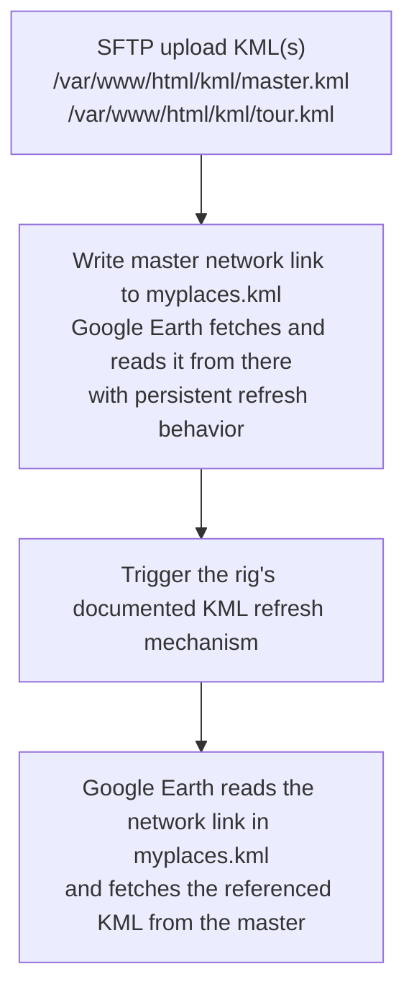

## Problem:

A KML renders fine in the virtual rig, but on a real rig it doesn't appear, only partially renders (geometry shows, icons don't), or appears once and then never updates.

## General Upload flow

The flowchart shows the sequence for publishing KML content to a physical Liquid Galaxy rig:

1. **Upload the KML files** to the master's web-accessible directory, such as `master.kml` and, if used, `tour.kml`.
2. **Write the master's network link to `myplaces.kml`**, including the tour link if applicable. Configure it with a persistent refresh interval. Make repeated updates safe and avoid duplicate links.
3. **Trigger the rig's KML refresh** through the target rig's documented mechanism. The trigger value and command can vary by installation.
4. **Google Earth (GE) fetches and reads the network link from `myplaces.kml`**, then retrieves the referenced KML content over the rig network.



## Pitfalls

Use the checks below to isolate whether a problem is caused by the KML itself, asset hosting, network access, caching, refresh configuration, or the remote command sequence. Commands and paths shown here reflect one common LG setup; confirm them against the target rig before running them.

| Symptom | Likely cause | What to inspect | Suggested fix |
| --- | --- | --- | --- |
| KML works in a virtual rig but not on the physical rig | The virtual environment may have local files or network access that the physical displays do not | Check the KML's `href` values, the physical rig's network connectivity, and whether the master serves the referenced files | Publish the KML and all dependencies to a location reachable by the rig; use the rig's configured HTTP host and port rather than a phone-local or developer-machine path |
| Nothing appears after upload | Wrong destination, malformed KML, unavailable URL, or the rig has not reloaded its KML | Confirm the uploaded file exists, inspect its contents, request it over HTTP, and check whether the reload trigger ran successfully | Correct the destination or KML, verify the served URL, then issue the confirmed reload command |
| New content does not replace old content | A fixed filename may be cached by Google Earth or an intermediate HTTP cache | Compare the file on disk with the HTTP response; inspect the KML URL and any cache headers | Use the cache-busting strategy supported by the rig, such as a timestamp query parameter, or a versioned filename where appropriate |
| Content appears once but never updates | The relevant network link has no persistent refresh interval, has an unsuitable refresh mode, or was not reloaded after configuration changed | Inspect the master's KML/network-link configuration and confirm the refresh interval, refresh mode, and reload behavior | Configure an appropriate persistent refresh interval using the application's supported mechanism; avoid creating duplicate links when publishing repeatedly |
| KML loads but visual elements are misplaced or absent | Invalid coordinates, unsupported geometry/style details, altitude settings, or unexpected rendering behavior | Open the KML in a validator or Google Earth, inspect coordinates and altitude modes, and reduce the file to a minimal reproducible example | Correct the KML structure and coordinate data; test complex geometry and styles incrementally on the target rig |

## Verifying on the rig

Run these checks on the master unless noted otherwise. Adjust paths, host, port, and refresh commands to match the target rig.

### 1. Confirm files and KML list

```bash
ls -lah /var/www/html/kml/
cat /var/www/html/kmls.txt
```

Confirm the KML and assets exist, are non-empty, and the list references the intended files.

### 2. Inspect KML links and refresh settings

```bash
grep -RniE '<(href|Link|NetworkLink)|refreshMode|refreshInterval' /var/www/html/kml/
```

Check that linked resources use reachable URLs and that network links have appropriate refresh settings.

### 3. Test the served KML

```bash
curl -I "http://lg1:81/kml/master.kml"
```

Confirm the response succeeds and the served content matches the uploaded file.

### 4. Test referenced assets

Request each icon or overlay URL from the KML, checking exact filename capitalization and paths.

### 5. Verify access from a slave

From a slave, request the same KML and asset URLs. If access fails, check routing, firewall rules, hostname resolution, and web-server binding.

### 6. Check the refresh trigger

Inspect the rig's documented trigger location and expected value, then confirm the remote command's exit status. A successful SSH session alone does not prove Google Earth reloaded the KML.
